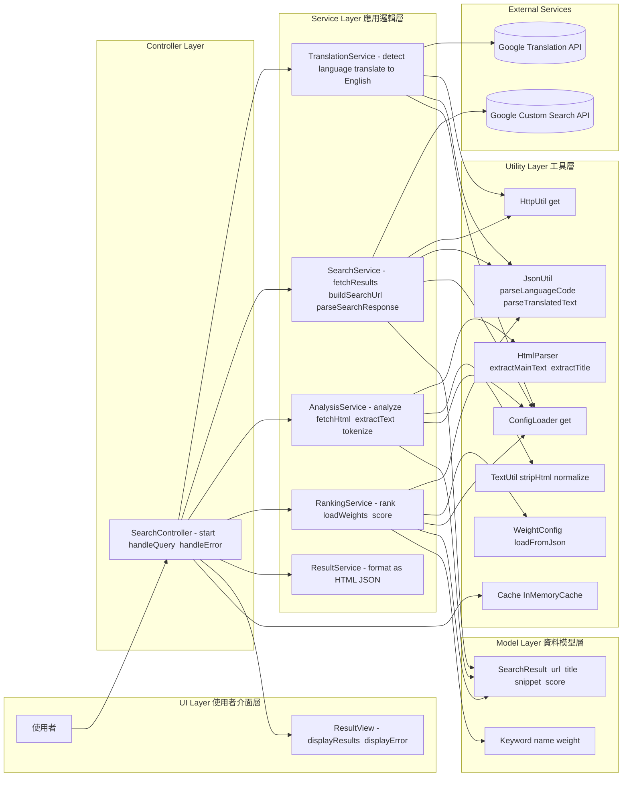
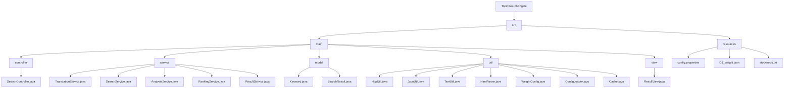
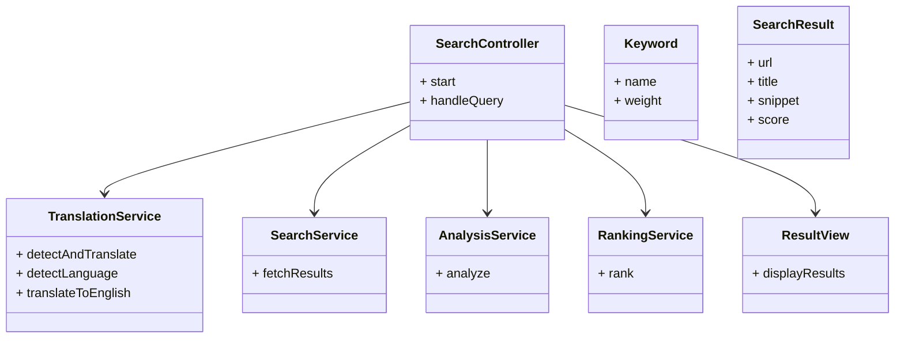
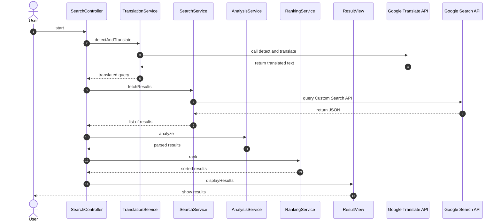

# DS_final_project
2025 Data Structure class

```mermaid
flowchart LR
  subgraph UI["UI Layer 使用者介面層"]
    U[使用者]
    V[ResultView - displayResults  displayError]
  end

  subgraph Controller["Controller Layer"]
    C[SearchController - start  handleQuery  handleError]
  end

  subgraph Service["Service Layer 應用邏輯層"]
    T[TranslationService - detect language translate to English]
    S[SearchService - fetchResults  buildSearchUrl  parseSearchResponse]
    A[AnalysisService - analyze  fetchHtml  extractText  tokenize]
    R[RankingService - rank  loadWeights  score]
    O[ResultService - format as HTML JSON]
  end

  subgraph Model["Model Layer 資料模型層"]
    M1[Keyword  name  weight]
    M2[SearchResult  url  title  snippet  score]
  end

  subgraph Util["Utility Layer 工具層"]
    H[HttpUtil  get]
    J[JsonUtil  parseLanguageCode  parseTranslatedText]
    X[TextUtil  stripHtml  normalize]
    P[HtmlParser  extractMainText  extractTitle]
    W[WeightConfig  loadFromJson]
    G[ConfigLoader  get]
    K[Cache  InMemoryCache]
  end

  subgraph External["External Services"]
    GT[(Google Translation API)]
    GS[(Google Custom Search API)]
  end

  U --> C
  C --> T --> GT
  C --> S --> GS
  C --> A
  C --> R
  C --> O
  C --> V

  T --> H
  T --> J
  S --> H
  S --> J
  R --> J
  A --> P
  A --> X
  R --> W
  T --> G
  S --> G
  A --> G
  R --> G
  C --> K

  S --> M2
  A --> M2
  R --> M2
  R --> M1
```

## 2. Folder Structure

```mermaid
flowchart TB
  A[TopicSearchEngine] --> B[src]
  B --> C[main]
  C --> D[controller]
  C --> E[service]
  C --> F[model]
  C --> G[util]
  C --> H[view]
  B --> R[resources]

  D --> D1[SearchController.java]
  E --> E1[TranslationService.java]
  E --> E2[SearchService.java]
  E --> E3[AnalysisService.java]
  E --> E4[RankingService.java]
  E --> E5[ResultService.java]
  F --> F1[Keyword.java]
  F --> F2[SearchResult.java]
  G --> G1[HttpUtil.java]
  G --> G2[JsonUtil.java]
  G --> G3[TextUtil.java]
  G --> G4[HtmlParser.java]
  G --> G5[WeightConfig.java]
  G --> G6[ConfigLoader.java]
  G --> G7[Cache.java]
  H --> H1[ResultView.java]
  R --> R1[config.properties]
  R --> R2[D1_weight.json]
  R --> R3[stopwords.txt]
```

## 3. Class Diagram

```mermaid
classDiagram
  class SearchController {
    + start
    + handleQuery
  }

  class TranslationService {
    + detectAndTranslate
    + detectLanguage
    + translateToEnglish
  }

  class SearchService {
    + fetchResults
  }

  class AnalysisService {
    + analyze
  }

  class RankingService {
    + rank
  }

  class ResultView {
    + displayResults
  }

  class Keyword {
    + name
    + weight
  }

  class SearchResult {
    + url
    + title
    + snippet
    + score
  }

  SearchController --> TranslationService
  SearchController --> SearchService
  SearchController --> AnalysisService
  SearchController --> RankingService
  SearchController --> ResultView
```

## 4. Sequence Diagram

```mermaid
sequenceDiagram
  autonumber
  actor User
  participant Controller as SearchController
  participant Trans as TranslationService
  participant Search as SearchService
  participant Anal as AnalysisService
  participant Rank as RankingService
  participant View as ResultView
  participant GT as Google Translate API
  participant GS as Google Search API

  User->>Controller: start
  Controller->>Trans: detectAndTranslate
  Trans->>GT: call detect and translate
  GT-->>Trans: return translated text
  Trans-->>Controller: translated query

  Controller->>Search: fetchResults
  Search->>GS: query Custom Search API
  GS-->>Search: return JSON
  Search-->>Controller: list of results

  Controller->>Anal: analyze
  Anal-->>Controller: parsed results

  Controller->>Rank: rank
  Rank-->>Controller: sorted results

  Controller->>View: displayResults
  View-->>User: show results
```
